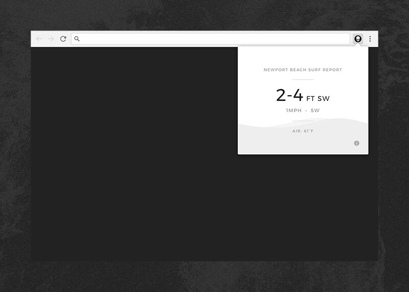

# Newport Beach Surf Report

A free Chrome extension that provides current swell and wind conditions for the city of Newport Beach, California. Data provided by the [Magic Seaweed](http://magicseaweed.com) API.

—

[Download](https://chrome.google.com/webstore/detail/newport-beach-surf-report/ejdnfoaapjhdlebeabhpeokllnofoedc)

—

